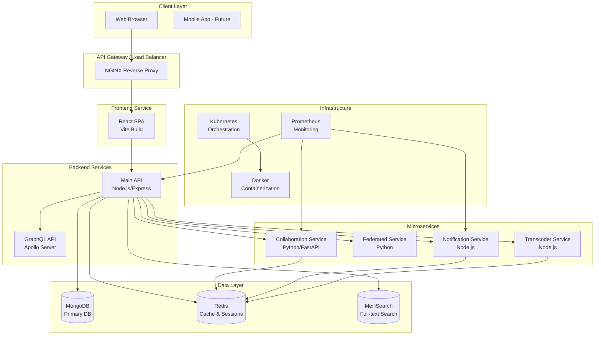

# System Architecture and Design Decisions

## Overview

College Media is a comprehensive social media platform for educational institutions, built as a microservices architecture with multiple specialized services. The platform provides features like user authentication, real-time collaboration, content streaming, notifications, and more.

### Core Components

- **Frontend**: React application with modern UI components
- **Backend API**: Node.js/Express REST API with GraphQL support
- **Microservices**:
  - Collaboration Service (Python)
  - Federated Service (Python)
  - Notification Service (Node.js)
  - Transcoder Service (Node.js)
- **Databases**: MongoDB (primary), Redis (caching/session)
- **Message Queue**: Redis for event-driven architecture
- **Real-time Communication**: Socket.io for WebRTC signaling and notifications
- **Search**: MeiliSearch for full-text search
- **Monitoring**: Prometheus metrics, structured logging

## System Architecture Diagram



## Service Architecture

### Main Backend API (Node.js/Express)

**Responsibilities:**
- User authentication and authorization
- REST API endpoints for core features
- GraphQL API for complex queries
- Rate limiting and security middleware
- Session management
- File upload handling

**Key Technologies:**
- Express.js framework
- JWT authentication
- bcrypt password hashing
- Socket.io for real-time features
- Swagger/OpenAPI documentation

### Collaboration Service (Python)

**Responsibilities:**
- Real-time collaborative editing
- Document synchronization
- Operational transformation
- Conflict resolution

**Key Technologies:**
- FastAPI framework
- WebSocket connections
- Redis for state management

### Federated Service (Python)

**Responsibilities:**
- Inter-institution data sharing
- Federated authentication
- Cross-platform content aggregation

### Notification Service (Node.js)

**Responsibilities:**
- Push notifications
- Email notifications
- In-app notifications
- Notification preferences management

### Transcoder Service (Node.js)

**Responsibilities:**
- Video/audio transcoding
- Media format conversion
- Thumbnail generation
- Content optimization

## Data Architecture

### Database Schema Design

#### User Collection
```javascript
{
  _id: ObjectId,
  username: String (unique, indexed),
  email: String (unique, indexed),
  password: String (hashed),
  firstName: String,
  lastName: String,
  profilePicture: String,
  bio: String,
  role: String (enum: user, moderator, admin),
  isActive: Boolean,
  isVerified: Boolean,
  followers: [ObjectId],
  following: [ObjectId],
  createdAt: Date,
  updatedAt: Date,
  lastLogin: Date,
  loginAttempts: Number,
  lockUntil: Date
}
```

#### Posts Collection
```javascript
{
  _id: ObjectId,
  authorId: ObjectId (indexed),
  content: String,
  media: [{
    type: String (image/video),
    url: String,
    thumbnail: String,
    metadata: Object
  }],
  likes: [ObjectId],
  comments: [{
    _id: ObjectId,
    authorId: ObjectId,
    content: String,
    createdAt: Date,
    updatedAt: Date
  }],
  tags: [String],
  visibility: String (public/friends/private),
  createdAt: Date,
  updatedAt: Date
}
```

### Caching Strategy

- **Session Storage**: Redis with TTL
- **API Response Cache**: Redis for frequently accessed data
- **Rate Limiting**: Redis-based distributed rate limiting
- **Real-time State**: Redis pub/sub for service communication

## Security Architecture

### Authentication & Authorization
- **JWT Tokens**: RS256 algorithm with key rotation
- **Multi-factor Authentication**: TOTP and backup codes
- **Session Management**: Single active session with refresh tokens
- **Password Policies**: Complexity requirements and breach checking

### API Security
- **Rate Limiting**: Distributed rate limiting with Redis
- **CSRF Protection**: Double-submit cookie pattern
- **CORS**: Configured for allowed origins
- **Input Validation**: Comprehensive validation middleware
- **SQL Injection Protection**: Parameterized queries

### Data Protection
- **Encryption at Rest**: AES-256 for sensitive data
- **Encryption in Transit**: TLS 1.3 required
- **Secrets Management**: HashiCorp Vault integration
- **Audit Logging**: Comprehensive security event logging

## Performance & Scalability

### Horizontal Scaling
- Stateless API services
- Database read replicas
- Redis cluster for caching
- Load balancing with Kubernetes

### Performance Optimizations
- Database indexing strategy
- Query optimization and aggregation
- CDN for static assets
- Compression middleware
- Connection pooling

### Monitoring & Observability
- **Metrics**: Prometheus with custom application metrics
- **Logging**: Structured logging with correlation IDs
- **Tracing**: Distributed tracing for request flows
- **Health Checks**: Comprehensive health endpoints

## Deployment Architecture

### Development Environment
- Docker Compose for local development
- Hot reloading for frontend/backend
- Local databases and services
- Development-specific configurations

### Production Environment
- Kubernetes orchestration
- Helm charts for deployment
- Ingress controllers for routing
- Persistent volumes for data
- ConfigMaps and Secrets for configuration

### CI/CD Pipeline
- Automated testing and linting
- Security scanning
- Container image building
- Deployment to staging/production
- Rollback capabilities

## Technology Choices Rationale

### Backend: Node.js/Express
- **JavaScript Ecosystem**: Consistent language across stack
- **Performance**: V8 engine optimizations
- **Scalability**: Event-driven architecture
- **Ecosystem**: Rich npm packages

### Microservices: Mixed Languages
- **Python Services**: Data processing and AI/ML capabilities
- **Node.js Services**: Real-time and I/O intensive operations
- **Language Appropriateness**: Best tool for each job

### Database: MongoDB
- **Document Model**: Flexible schema for social media data
- **Scalability**: Horizontal scaling capabilities
- **Indexing**: Rich indexing options
- **Aggregation**: Powerful query capabilities

### Real-time: Socket.io
- **WebSocket Fallback**: Automatic fallback to polling
- **Scalability**: Redis adapter for clustering
- **Reliability**: Connection recovery and error handling

This architecture provides a robust, scalable, and maintainable foundation for the College Media platform, designed to handle the complex requirements of a modern social media application for educational institutions.