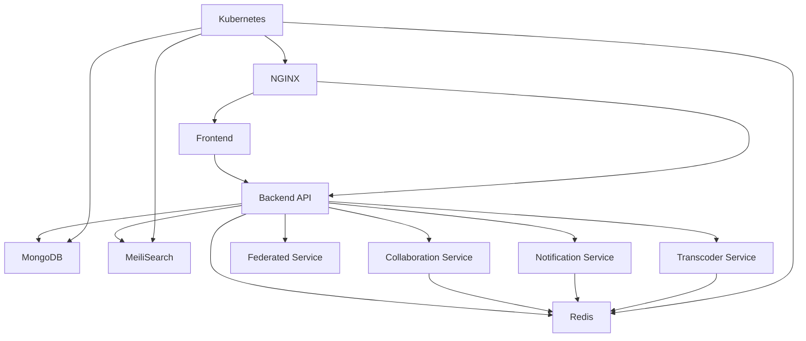

# Services Documentation

## Overview

College Media is built as a microservices architecture with multiple specialized services working together to provide a comprehensive social media platform. This document describes each service, its responsibilities, and how they interact.

## Service Architecture

### Main Backend API (`backend/`)

**Technology Stack:**
- Node.js with Express.js
- MongoDB (primary database)
- Redis (caching and sessions)
- Socket.io (real-time communication)

**Responsibilities:**
- User authentication and authorization (JWT, MFA)
- REST API endpoints for core platform features
- GraphQL API for complex data queries
- Rate limiting and security middleware
- Session management and CSRF protection
- File upload and media handling
- Real-time features (WebRTC signaling, notifications)

**Key Features:**
- Multi-factor authentication (TOTP + backup codes)
- Distributed rate limiting
- Comprehensive logging with correlation IDs
- Health monitoring and metrics
- Swagger/OpenAPI documentation

**Ports:** 5000 (HTTP), 5001 (HTTPS)

### Collaboration Service (`collab-service/`)

**Technology Stack:**
- Python with FastAPI
- Redis for state management
- WebSocket connections

**Responsibilities:**
- Real-time collaborative document editing
- Operational transformation for conflict resolution
- Multi-user synchronization
- Document versioning and history

**Key Features:**
- Real-time cursor positions
- Conflict-free replicated data types (CRDT)
- Document locking and permissions
- Change history and undo/redo

**Ports:** 8001

### Federated Service (`federated-service/`)

**Technology Stack:**
- Python with Flask/FastAPI
- External API integrations

**Responsibilities:**
- Inter-institution data sharing and federation
- Cross-platform authentication protocols
- Content aggregation from multiple sources
- Data synchronization between institutions

**Key Features:**
- OAuth 2.0 / OpenID Connect integration
- ActivityPub protocol support (future)
- Data export/import capabilities
- Institution relationship management

**Ports:** 8002

### Notification Service (`notification-service/`)

**Technology Stack:**
- Node.js with Express.js
- Redis for message queuing
- Email service integrations (SendGrid, SES)

**Responsibilities:**
- Push notifications (web/mobile)
- Email notifications
- In-app notification management
- Notification preferences and settings

**Key Features:**
- Real-time push notifications via WebSocket
- Scheduled email digests
- Notification templates and customization
- Delivery tracking and analytics

**Ports:** 8003

### Transcoder Service (`transcoder-service/`)

**Technology Stack:**
- Node.js
- FFmpeg for media processing
- Redis for job queuing

**Responsibilities:**
- Video and audio transcoding
- Media format conversion
- Thumbnail generation
- Content optimization for different devices

**Key Features:**
- Multiple output formats (HLS, MP4, WebM)
- Adaptive bitrate streaming
- Video compression and optimization
- Batch processing capabilities

**Ports:** 8004

## Supporting Services

### Frontend (`frontend/`)

**Technology Stack:**
- React 18 with Vite
- TypeScript
- Tailwind CSS
- PWA capabilities

**Responsibilities:**
- User interface and user experience
- Client-side routing and state management
- API integration
- Real-time UI updates

**Key Features:**
- Progressive Web App (PWA)
- Responsive design
- Accessibility compliance
- Offline capabilities

### Database Services

#### MongoDB
- Primary data storage
- Document-based storage for flexible schemas
- User data, posts, comments, media metadata

#### Redis
- Session storage
- Caching layer
- Message queuing for microservices
- Rate limiting data

#### MeiliSearch
- Full-text search engine
- User search, content search
- Faceted search and filtering

### Infrastructure Services

#### NGINX (Reverse Proxy)
- Load balancing
- SSL termination
- Static file serving
- API gateway functionality

#### Kubernetes
- Container orchestration
- Service discovery
- Auto-scaling
- Rolling deployments

## Service Communication

### Synchronous Communication
- REST API calls between services
- GraphQL queries from frontend to backend
- Direct database access (where appropriate)

### Asynchronous Communication
- Redis pub/sub for event-driven architecture
- Message queues for background processing
- WebSocket connections for real-time features

### Service Discovery
- Kubernetes DNS for internal service resolution
- Environment variables for external service URLs
- Configuration management via ConfigMaps

## Service Dependencies

## Development and Deployment

### Local Development
- Docker Compose for all services
- Hot reloading for frontend/backend
- Shared volumes for development

### Production Deployment
- Kubernetes manifests in `k8s/` directory
- Helm charts for complex deployments
- CI/CD pipelines for automated deployment

### Monitoring and Logging
- Prometheus metrics collection
- Structured logging with correlation IDs
- Centralized logging aggregation
- Health check endpoints for all services

## Service Health Checks

Each service provides health check endpoints:

- **Backend API**: `GET /` - Returns service status and metrics
- **Collaboration Service**: `GET /health`
- **Federated Service**: `GET /health`
- **Notification Service**: `GET /health`
- **Transcoder Service**: `GET /health`

## Scaling Considerations

### Horizontal Scaling
- Stateless services (API, microservices) can be scaled horizontally
- Database read replicas for read-heavy workloads
- Redis clustering for high availability

### Vertical Scaling
- Resource-intensive services (transcoder) may need more CPU/memory
- Database optimization and indexing

### Auto-scaling
- Kubernetes HPA based on CPU/memory metrics
- Custom metrics for queue-based scaling (transcoder jobs)

This documentation provides a comprehensive overview of all services in the College Media platform and their interactions.</content>
<parameter name="filePath">c:\Users\Gupta\Downloads\College_Media\docs\SERVICES.md